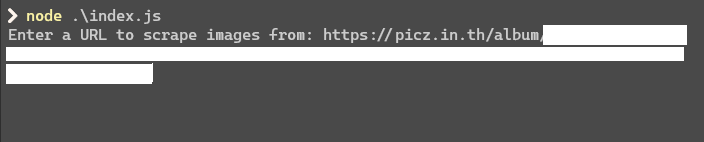
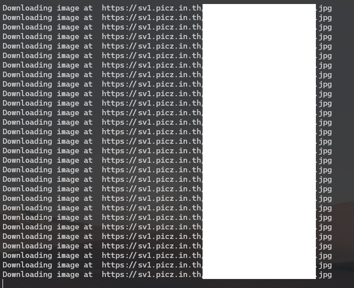

# picz-bulk-downloader

A simple command-line tool to bulk scrape images from picz album.

## Requirements

- Node.js
- npm

## Installation

1. Clone this repository.
2. Run `npm install` to install the dependencies.

## Usage

1. Run `node index.js` to start the tool.
2. Enter the URL of picz album site from which you want to bulk scrape images.
3. Enter password and valid captcha for access your album
3. The images will be downloaded to the current directory.

## Notes

- The tool uses [Puppeteer](https://github.com/puppeteer/puppeteer) to scrape the images.
- The tool downloads the images as JPEG files and names them `image-0.jpg`, `image-1.jpg`, etc.

## License

This project is licensed under the MIT License. See the [LICENSE](LICENSE) file for details.
